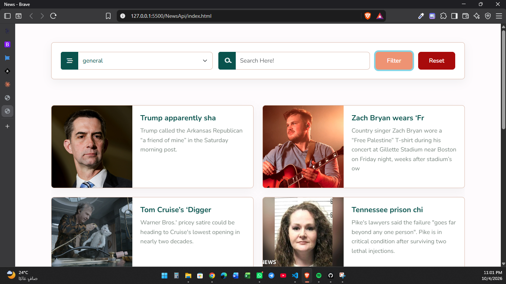
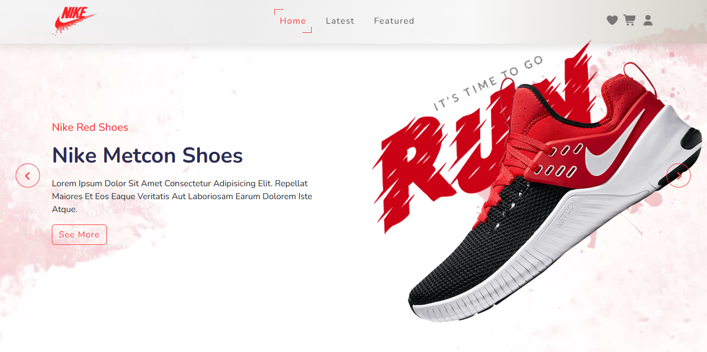
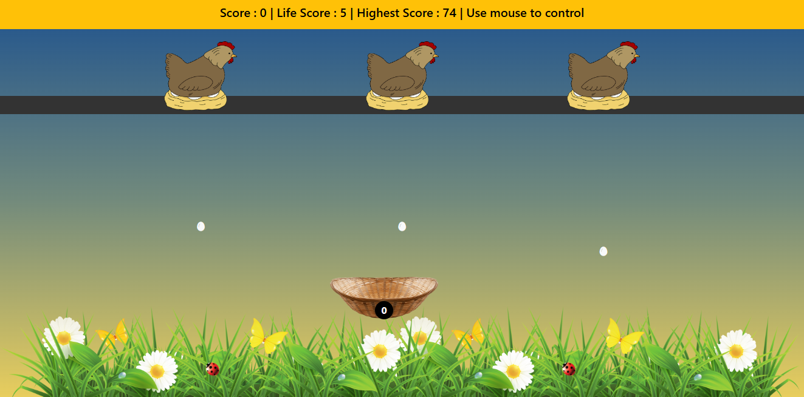
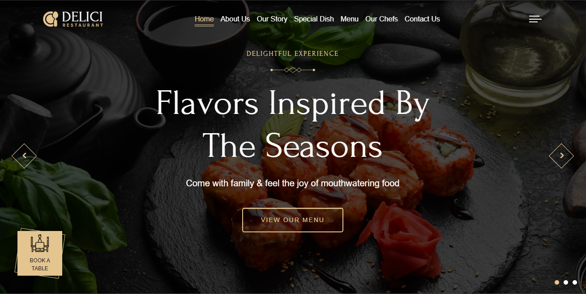
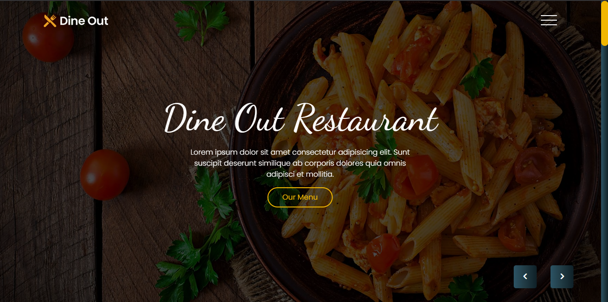
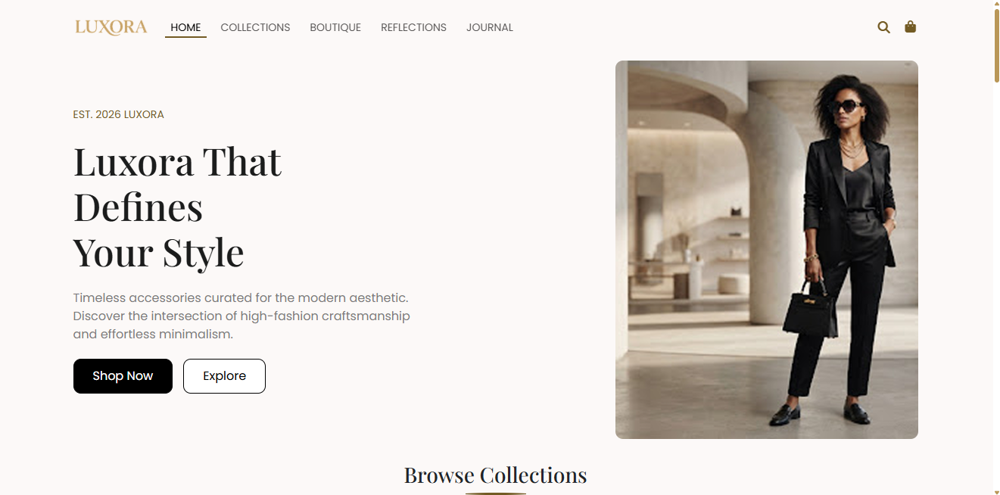
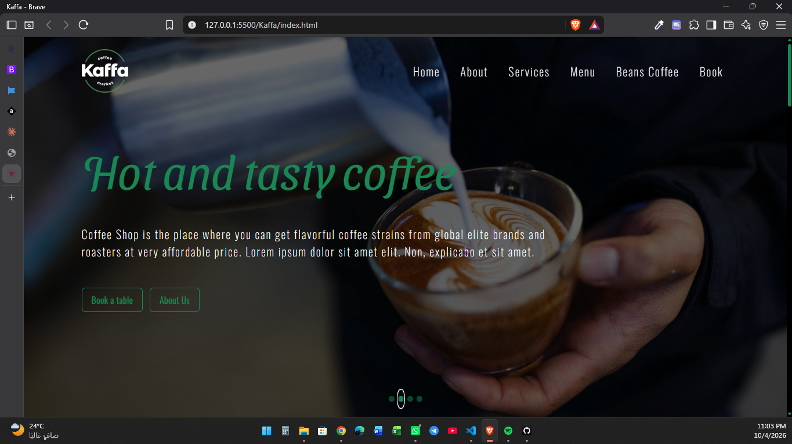

<div align="center">
<p>

</p>

<p>
  <a href="https://github.com/mando157">
    
  </a>
  <a href="https://www.linkedin.com/in/mohamed-hassan-412896348">
    
  </a>
  <a href="mailto:mando.1572005@gmail.com">
    
  </a>
</p>

</div>

---
## About Me ...

<div align="center">

<table width="92%">
<tr>

<td width="58%" valign="top">

### `Mohamed Hassan`

**Third-Year Computer Science Student**  
`Information Systems • Frontend Developer`

<br>

I enjoy turning ideas into **interfaces that feel alive**.

I like building things, breaking them, understanding **why they broke**,  
and coming back with a better solution.

<br>

> **Frontend → Angular → Backend → Full-Stack**

<br>

Currently exploring:

`JavaScript` · `TypeScript` · `Angular` · `REST APIs`  
`Dynamic Data` · `Responsive Design` · `Software Engineering`

</td>

<td width="42%" align="center">


<br>

```js
const developer = {
  name: "Mohamed Hassan",
  focus: "Frontend",
  next: "Angular",
  goal: "Full-Stack"
};
```

</td>

</tr>
</table>
<br>

<code>console.log("Still learning. Still building. Still improving.");</code>

</div>

---

## What I Do ?

<table width="100%">
<tr>

<td width="33%" align="center" valign="top">


<br><br>

<h3> Frontend Development</h3>

<p>
I build <b>responsive, interactive interfaces</b> with clean structure,
reusable components, and attention to the details that make a website
feel smooth and alive.
</p>

<br>


</td>

<td width="33%" align="center" valign="top">


<br><br>

<h3> API Integration</h3>

<p>
I work with <b>REST APIs</b>, asynchronous JavaScript and dynamic data
to build experiences with filtering, searching, pagination,
and real-time content rendering.
</p>

<br>


</td>

<td width="33%" align="center" valign="top">


<br><br>

<h3> Full-Stack Direction</h3>

<p>
I'm expanding beyond the frontend, diving deeper into <b>PHP</b>
and preparing to explore <b>Laravel</b> and backend development
to complete the journey toward Full-Stack.
</p>

<br>


</td>

</tr>
</table>

<br>

<div align="center">


</div>

---

## Development Philosophy

<div align="center">

### <code>UNDERSTAND</code> → <code>BUILD</code> → <code>SOLVE</code> → <code>IMPROVE</code>

<br>

<table width="100%">
<tr>

<td width="25%" align="center">


### Understand

**Learn the fundamentals.**

I don't want to just know *how* something works — I want to understand **why** it works.

</td>

<td width="25%" align="center">


### Build

**Turn knowledge into code.**

The best way to learn is to actually **build things**, experiment, and get your hands dirty.

</td>

<td width="25%" align="center">


### Solve

**Problems are part of the process.**

Debugging, researching, trying again, and eventually finding the **"aha!" moment**.

</td>

<td width="25%" align="center">


### Improve

**Never settle for "it works".**

Refactor. Optimize. Learn something new.  
Then make the next version **better than the last**.

</td>

</tr>
</table>

<br>

```diff
- I know how to write code.
+ I understand what I'm building.

- It works.
+ I know why it works.

- Another project.
+ Another lesson learned.
```

<br>

### <code>while (learning) { build(); solve(); improve(); }</code>

<br>

> **"Don't just make it work — understand why it works."**

<br>

<sub>
Every project teaches me something new. Every bug makes me better.
</sub>

</div>
# Featured Projects

<div align="center">

<br>


&nbsp;

&nbsp;


<br><br>

<p>
A collection of projects where I turn ideas into <b>responsive interfaces</b>,
experiment with <b>JavaScript & APIs</b>, and keep pushing my frontend skills forward.
</p>

</div>

<br>

<table width="100%">
<tr>

<td width="50%" valign="top">

<div align="center">

<a href="https://mando157.github.io/News/">

</a>

### 📰 News Website

<code>Dynamic News Platform</code>

A responsive news platform powered by <b>NewsAPI</b>, featuring categories, search, dynamic rendering, and pagination.

**Stack**

`HTML` `CSS` `Bootstrap` `JavaScript` `jQuery` `REST API`

<br>

<a href="https://mando157.github.io/News/">

</a>
&nbsp;
<a href="https://github.com/mando157/News">

</a>

</div>

</td>

<td width="50%" valign="top">

<div align="center">

<a href="https://mando157.github.io/Nike/">

</a>

### 👟 Nike

<code>Vanilla JavaScript Experience</code>

A responsive Nike-inspired interface built from scratch with <b>Vanilla JavaScript</b>, focusing on interactions and dynamic UI behavior.

**Stack**

`HTML` `CSS` `Bootstrap` `JavaScript`

<br>

<a href="https://mando157.github.io/Nike/">

</a>
&nbsp;
<a href="https://github.com/mando157/Nike">

</a>

</div>

</td>

</tr>

<tr>

<td width="50%" valign="top">

<div align="center">

<a href="https://mando157.github.io/chickenGame/">

</a>

### 🐔 Chicken Game

<code>Interactive JavaScript Game</code>

A browser game built around <b>keyboard controls, animation loops, collision handling, scoring, and dynamic gameplay.</b>

**Stack**

`HTML` `CSS` `SCSS` `Bootstrap` `jQuery` `JavaScript`

<br>

<a href="https://mando157.github.io/chickenGame/">

</a>
&nbsp;
<a href="https://github.com/mando157/chickenGame">

</a>

</div>

</td>

<td width="50%" valign="top">

<div align="center">

<a href="https://mando157.github.io/Delici/">

</a>

### 🍽️ Delici

<code>Restaurant Landing Experience</code>

A responsive restaurant website focused on <b>clean layout, typography, visual hierarchy, and responsive design.</b>

**Stack**

`HTML` `CSS` `Bootstrap` `JavaScript`

<br>

<a href="https://mando157.github.io/Delici/">

</a>
&nbsp;
<a href="https://github.com/mando157/Delici">

</a>

</div>

</td>

</tr>

<tr>

<td width="50%" valign="top">

<div align="center">

<a href="https://mando157.github.io/DineOut/">

</a>

### 🍴 DineOut

<code>Responsive Restaurant UI</code>

A modern restaurant interface built with a focus on <b>responsive layouts, reusable Bootstrap components, and clean visual structure.</b>

**Stack**

`HTML` `CSS` `Bootstrap`

<br>

<a href="https://mando157.github.io/DineOut/">

</a>
&nbsp;
<a href="https://github.com/mando157/DineOut">

</a>

</div>

</td>

<td width="50%" valign="top">

<div align="center">

<a href="https://mando157.github.io/luxora/">

</a>

### ✨ Luxora

<code>Luxury E-Commerce Concept</code>

One of my early complete projects, built from <b>design to final implementation</b> with a strong focus on responsive UI and visual consistency.

**Stack**

`HTML` `CSS` `Bootstrap`

<br>

<a href="https://mando157.github.io/luxora/">

</a>
&nbsp;
<a href="https://github.com/mando157/luxora">

</a>

</div>

</td>

</tr>

<tr>

<td width="50%" valign="top">

<div align="center">

<a href="https://mando157.github.io/kaffa/">

</a>

### ☕ Kaffa

<code>Coffee Shop Experience</code>

A responsive coffee shop website built with <b>Bootstrap and custom styling</b>, focusing on layout, typography, and component structure.

**Stack**

`HTML` `CSS` `Bootstrap`

<br>

<a href="https://mando157.github.io/kaffa/">

</a>
&nbsp;
<a href="https://github.com/mando157/kaffa">

</a>

</div>

</td>

</tr>
</table>

<br>

<div align="center">

### ⚡ From pixels to products.

<code>Every project → a new challenge → a new lesson.</code>

</div>

---
---

# Tech Stack

<div align="center">

### Frontend


<br><br>

### Backend & Programming


<br><br>

### Tools


</div>

---

# 🔌 Web Development

<table width="100%">
<tr>

<td width="50%" valign="top">

### 🔗 APIs & Data

- REST APIs
- Fetch API
- JSON
- Async JavaScript
- Dynamic Data Rendering
- API Integration
- Search & Filtering
- Pagination

</td>

<td width="50%" valign="top">

### ⚙️ Frontend Fundamentals

- Responsive Design
- DOM Manipulation
- Event Handling
- JavaScript Logic
- UI Interactions
- Component Thinking
- Cross-Screen Layouts
- Clean & Maintainable Code

</td>

</tr>
</table>

---

# Current Learning Path

<table width="100%">
<tr>

<td width="33%" valign="top">

### ⚡ JavaScript

Deepening JavaScript fundamentals through real projects, DOM manipulation, asynchronous programming, APIs, and interactive experiences.

</td>

<td width="33%" valign="top">

### 🔷 Angular

Strengthening TypeScript and moving toward Angular development, reusable components, services, routing, and scalable frontend architecture.

</td>

<td width="33%" valign="top">

### 🔗 Backend

Expanding into PHP and preparing to work with Laravel for backend development and REST API creation.

</td>

</tr>
</table>

---
## Education

<div align="center">


<br>

###  Computer Science

**Information Systems (IS)**

<br>

<table>
<tr>
<td align="center" width="180">

### `01`

**FOUNDATION**

Computer Science

</td>

<td align="center" width="80">

### →

</td>

<td align="center" width="180">

### `02`

**SPECIALIZATION**

Information Systems

</td>

<td align="center" width="80">

### →

</td>

<td align="center" width="180">

### `03`

**CURRENT**

Third Year

</td>
</tr>
</table>

<br>


<br>

### <code>ACADEMIC JOURNEY</code>

<table width="85%">
<tr>
<td align="center">

**ACADEMIC KNOWLEDGE**

`Computer Science` · `Information Systems` · `Problem Solving`

</td>

<td align="center">

**PRACTICAL GROWTH**

`Real-World Projects` · `Software Engineering` · `Continuous Learning`

</td>
</tr>
</table>

<br>

<sub>Currently studying, continuously building, always moving forward.</sub>

</div>

---
---

# GitHub Activity

<div align="center">


<br><br>


<br><br>


</div>

---
# 🌐 Connect With Me

<div align="center">

### <code>LET'S BUILD SOMETHING GREAT</code>

<br>

<table>
<tr>

<td align="center" width="150">

<a href="https://github.com/mando157">

</a>

<br>
<sub>Projects & Code</sub>

</td>

<td align="center" width="150">

<a href="https://www.linkedin.com/in/mohamed-hassan-412896348">

</a>

<br>
<sub>Professional Network</sub>

</td>

<td align="center" width="150">

<a href="mailto:mando.1572005@gmail.com">

</a>

<br>
<sub>Let's Talk</sub>

</td>

<td align="center" width="150">

<a href="https://wa.me/201110257589">

</a>

<br>
<sub>Quick Chat</sub>

</td>

</tr>
</table>

<br>


<br>

<a href="https://mando157.github.io/Portfolio/">

</a>

<br><br>

### <code>CODE</code> · <code>CREATE</code> · <code>CONNECT</code>

<sub>
Open to conversations, collaborations, opportunities, and interesting ideas.
</sub>

<br><br>


</div>
<br>


</div>
